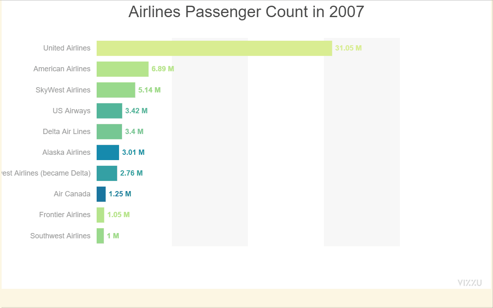

# ipyvizzu and streamlit
In this repo using San Francisco Airport Data I have created animations with ipyvizzu.
As part of 2nd phase of this project, I will implement the same in Streamlit.

## Binder Link
https://hub.gke2.mybinder.org/user/atifiu-ipyvizzu-streamlit-9mwjibyx/doc/tree/Ipyvizzu_sf_dataset.ipynb

## Demo app

### Horizontal Bar plot showing Passenger Count of top 10 Airlines every year.
 